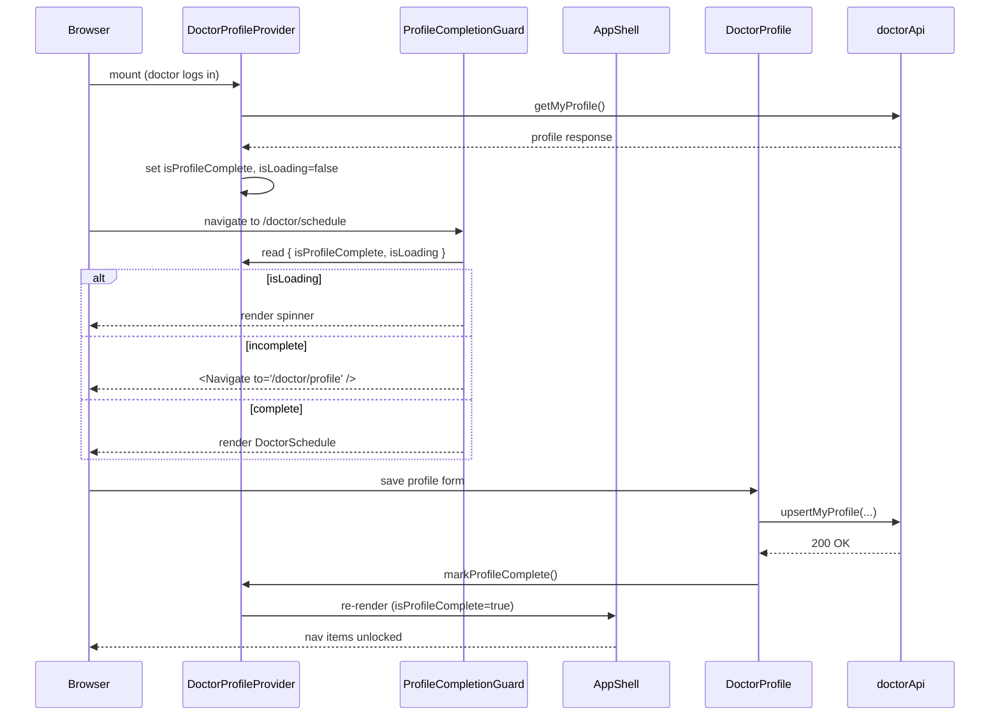

# Design Document: Doctor Profile Gate

## Overview

The Doctor Profile Gate adds a lightweight access-control layer on top of the existing authenticated routing. When a doctor's profile is incomplete (no `specialization`), they are confined to `/doctor/profile` — both at the route level (redirect on direct URL access) and at the UI level (sidebar nav items locked). The gate is lifted the moment the doctor saves a valid profile, with no page reload required.

The implementation introduces one new file (`DoctorProfileContext.jsx`) and one new component (`ProfileCompletionGuard`), then makes targeted edits to `App.jsx`, `AppShell.jsx`, and `DoctorProfile.jsx`. Patient routes and non-doctor users are completely unaffected.

---

## Architecture

```mermaid
graph TD
    A[App.jsx] -->|wraps doctor routes| B[DoctorProfileProvider]
    B -->|provides context| C[ProfileCompletionGuard]
    B -->|provides context| D[AppShell]
    B -->|provides context| E[DoctorProfile]

    C -->|incomplete → redirect| F[/doctor/profile]
    C -->|complete → render| G[Gated Route]

    E -->|on save success| H[markProfileComplete]
    H -->|updates context state| B

    D -->|reads isProfileComplete| I[Nav item lock/unlock]
```



---

## Components and Interfaces

### Component 1: DoctorProfileContext

**File:** `src/features/doctor/context/DoctorProfileContext.jsx`

**Purpose:** Single source of truth for the doctor's profile completion state. Fetches the profile once on mount, exposes the state and an updater to all consumers.

**Interface:**

```jsx
// Context shape
const DoctorProfileContextValue = {
  isProfileComplete: boolean,   // true when specialization is non-empty
  isLoading: boolean,           // true while getMyProfile() is in-flight
  markProfileComplete: () => void, // called by DoctorProfile after successful save
};

// Provider component
function DoctorProfileProvider({ children }) { ... }

// Consumer hook
function useDoctorProfile() {
  return useContext(DoctorProfileContext);
}
```

**Responsibilities:**
- Call `doctorApi.getMyProfile()` once on mount
- Derive `isProfileComplete` from `profile.specialization` being a non-empty string
- Treat API errors and missing profiles as incomplete
- Expose `markProfileComplete()` so `DoctorProfile` can flip the state without a second API call
- Only fetch when the authenticated user is a `DOCTOR` (checked via `authApi.me()` or passed as a prop — see Data Flow section)

---

### Component 2: ProfileCompletionGuard

**File:** `src/features/doctor/context/DoctorProfileContext.jsx` (co-located with the context, or a separate file — see Notes)

**Purpose:** Route wrapper that enforces the profile gate at the routing layer.

**Interface:**

```jsx
function ProfileCompletionGuard({ children }) { ... }
```

**Responsibilities:**
- Read `{ isProfileComplete, isLoading }` from `DoctorProfileContext`
- While `isLoading === true`: render a centered spinner (matching the existing app spinner style)
- When `isLoading === false && isProfileComplete === false`: render `<Navigate to="/doctor/profile" replace />`
- When `isLoading === false && isProfileComplete === true`: render `children`
- Never redirect away from `/doctor/profile` (the guard is only applied to gated routes in `App.jsx`, not to `/doctor/profile` itself)

---

### Component 3: AppShell (modified)

**File:** `src/shared/ui/AppShell.jsx`

**Purpose:** Consumes `DoctorProfileContext` to lock/unlock the "My Schedule" and "Messages" nav items for doctors.

**Changes:**
- Import `useDoctorProfile` from the context
- For `DOCTOR` role: read `isProfileComplete` from context
- Annotate `doctorNav` items with a `gated: true` flag for "My Schedule" and "Messages"
- In the nav render loop: when `role === 'DOCTOR' && !isProfileComplete && item.gated`, apply disabled styles and suppress the `onClick` handler

**Disabled nav item style** (matches existing design language):
```jsx
// Disabled state
{
  opacity: 0.35,
  cursor: 'not-allowed',
  pointerEvents: 'none',  // belt-and-suspenders alongside the onClick guard
}
```

---

### Component 4: DoctorProfile (modified)

**File:** `src/features/doctor/pages/DoctorProfile.jsx`

**Purpose:** Replace local `isNewDoctor` state with context-driven state; call `markProfileComplete()` on successful save.

**Changes:**
- Import `useDoctorProfile`
- Remove local `isNewDoctor` state and its setter
- Replace all reads of `isNewDoctor` with `!isProfileComplete` from context
- In `handleSave`, after `await doctorApi.upsertMyProfile(...)` succeeds, call `markProfileComplete()` instead of `setIsNewDoctor(false)`
- Remove the local `doctorApi.getMyProfile()` call in the `load()` effect — the context already fetched it. Keep only `authApi.me()` for the `user` state.
- Keep the `profileLoading` guard: use `isLoading` from context instead of local `profileLoading` state

---

## Data Flow

### Provider Placement

The `DoctorProfileProvider` wraps only the doctor-specific routes in `App.jsx`. This keeps the context out of patient and admin routes entirely.

```jsx
// App.jsx — after change
import { DoctorProfileProvider, ProfileCompletionGuard } from './features/doctor/context/DoctorProfileContext';

// Inside <Routes>:
<Route path="/doctor/profile"
  element={
    <ProtectedRoute>
      <DoctorProfileProvider>
        <DoctorProfile />
      </DoctorProfileProvider>
    </ProtectedRoute>
  }
/>
<Route path="/doctor/schedule"
  element={
    <ProtectedRoute>
      <DoctorProfileProvider>
        <ProfileCompletionGuard>
          <DoctorSchedule />
        </ProfileCompletionGuard>
      </DoctorProfileProvider>
    </ProtectedRoute>
  }
/>
<Route path="/chat"
  element={
    <ProtectedRoute>
      <DoctorProfileProvider>
        <ProfileCompletionGuard>
          <ChatInterface />
        </ProfileCompletionGuard>
      </DoctorProfileProvider>
    </ProtectedRoute>
  }
/>
```

> **Note on provider per-route vs. single provider:** Wrapping each route individually means a fresh API call per navigation. An alternative is to hoist a single `DoctorProfileProvider` above all routes and have it no-op for non-doctor users. The per-route approach is simpler and avoids any risk of stale state across role boundaries. Given that `getMyProfile()` is a cheap GET and is already called by `Dashboard.jsx` and `DoctorProfile.jsx`, this is acceptable. If the extra call becomes a concern, the provider can be hoisted and guarded by role.

### State Transitions

```
Initial mount
  └─ isLoading: true, isProfileComplete: false

getMyProfile() resolves with specialization non-empty
  └─ isLoading: false, isProfileComplete: true

getMyProfile() resolves with specialization empty/null
  └─ isLoading: false, isProfileComplete: false

getMyProfile() rejects (error / 404)
  └─ isLoading: false, isProfileComplete: false

markProfileComplete() called
  └─ isLoading: false, isProfileComplete: true  (no API call)
```

---

## File Changes Summary

| File | Change Type | Summary |
|------|-------------|---------|
| `src/features/doctor/context/DoctorProfileContext.jsx` | **New** | Context, provider, guard, and `useDoctorProfile` hook |
| `src/App.jsx` | **Modified** | Import provider + guard; wrap gated routes |
| `src/shared/ui/AppShell.jsx` | **Modified** | Consume context; disable gated nav items for incomplete doctors |
| `src/features/doctor/pages/DoctorProfile.jsx` | **Modified** | Use context state instead of local `isNewDoctor`; call `markProfileComplete()` on save |

No backend changes are required. No new dependencies are introduced.

---

## Error Handling

### API Error on Profile Fetch

If `doctorApi.getMyProfile()` throws (network error, 404, 500), the provider catches the error and sets `isProfileComplete = false`, `isLoading = false`. The doctor is treated as incomplete and redirected to `/doctor/profile` where they can attempt to save. This matches the existing behavior in `DoctorProfile.jsx` and `Dashboard.jsx`.

### Context Used Outside Provider

`useDoctorProfile()` should throw a descriptive error if called outside a `DoctorProfileProvider`. This prevents silent failures during development:

```jsx
function useDoctorProfile() {
  const ctx = useContext(DoctorProfileContext);
  if (!ctx) throw new Error('useDoctorProfile must be used within DoctorProfileProvider');
  return ctx;
}
```

### AppShell Called for Non-Doctor Users

`AppShell` is shared by patients and admins. The context consumption must be conditional: only call `useDoctorProfile()` when `role === 'DOCTOR'`. Since `AppShell` is rendered inside routes that may or may not have a `DoctorProfileProvider`, the safest approach is to use `useContext` directly (not the throwing hook) and treat a `null` context as "no gate applies":

```jsx
// In AppShell.jsx
const doctorProfileCtx = useContext(DoctorProfileContext);
const isProfileComplete = role === 'DOCTOR' ? (doctorProfileCtx?.isProfileComplete ?? true) : true;
```

Defaulting to `true` when context is absent means non-doctor users never see locked nav items.

---

## Testing Strategy

### Unit Testing Approach

- **DoctorProfileContext**: Test that `isProfileComplete` is `true` when `specialization` is non-empty, `false` when empty/null/missing, and `false` on API error. Test that `markProfileComplete()` flips the state to `true` without an API call.
- **ProfileCompletionGuard**: Test that it renders a spinner while loading, redirects to `/doctor/profile` when incomplete, and renders children when complete.
- **AppShell**: Test that doctor nav items with `gated: true` receive disabled styles and suppressed click handlers when `isProfileComplete` is `false`, and are fully interactive when `true`. Test that patient nav items are never affected.

### Property-Based Testing Approach

Property tests are not applicable to this feature. The core logic is UI state management and conditional rendering — behavior does not vary meaningfully across a large input space in a way that property-based testing would reveal additional bugs beyond example-based tests. The guard logic is a simple boolean decision tree.

### Integration Testing Approach

- Mount the full route tree with a mocked `doctorApi.getMyProfile()` returning an incomplete profile; assert that navigating to `/doctor/schedule` renders the spinner then redirects.
- Mount with a complete profile; assert that `/doctor/schedule` renders `DoctorSchedule`.
- Simulate a save in `DoctorProfile`; assert that the nav items unlock and the guard no longer redirects.

---

## Correctness Properties

*A property is a characteristic or behavior that should hold true across all valid executions of a system — essentially, a formal statement about what the system should do.*

### Property 1: Incomplete profile always blocks gated routes

*For any* doctor user whose `specialization` is absent, null, or empty, navigating to `/doctor/schedule` or `/chat` SHALL result in a redirect to `/doctor/profile`, regardless of how the navigation was initiated (sidebar click, direct URL, programmatic `navigate()`).

**Validates: Requirements 2.1, 2.2**

### Property 2: Complete profile never blocks gated routes

*For any* doctor user whose `specialization` is a non-empty string, the `ProfileCompletionGuard` SHALL render the requested page content for all Gated_Routes without redirecting.

**Validates: Requirements 2.3**

### Property 3: Profile save immediately unlocks all gates

*For any* doctor with an incomplete profile who successfully saves a profile with non-empty `specialization`, `clinicName`, and `clinicAddress`, the `isProfileComplete` state SHALL transition to `true` and both the sidebar nav items and route guard SHALL reflect the unlocked state in the same render cycle — without a page reload or additional API call.

**Validates: Requirements 4.1, 4.2, 4.3**

### Property 4: Patient nav items are never locked

*For any* authenticated user with role `PATIENT`, the `AppShell` SHALL render all nav items in their fully interactive state regardless of any doctor profile completion state.

**Validates: Requirements 2.4, 3.5**

### Property 5: Profile page is always accessible

*For any* doctor user regardless of `isProfileComplete` value, the `ProfileCompletionGuard` SHALL never be applied to `/doctor/profile`, and the "My Profile" sidebar nav item SHALL always be rendered in its fully interactive state.

**Validates: Requirements 5.1, 5.2, 5.3**

---

## Dependencies

No new npm packages are required. The implementation uses:

- `react` — `createContext`, `useContext`, `useState`, `useEffect` (already a project dependency)
- `react-router-dom` — `Navigate`, `useLocation` (already used throughout the app)
- `../../../shared/api/api` — `doctorApi.getMyProfile()` (already exists)
